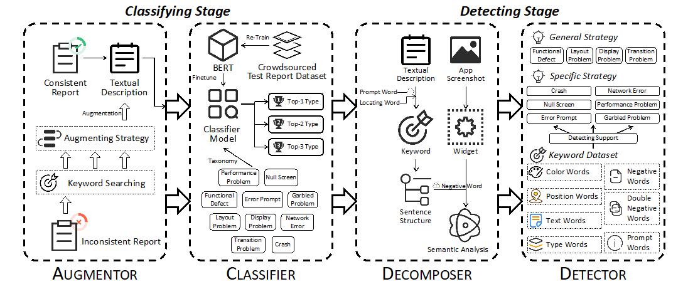

众包测试作为一种新型测试范式，能够真实地从用户的角度对待测应用进行测试。得益于众包测试汇聚群体智能的特点，其近年来在工业软件的质量保障中起到了重要作用。越来越多的工业软件测试采用众包测试的模式，通过众包工人对于工业软件业务逻辑的理解，有效地对工业软件中关键核心功能进行测试，从而不断提升工业软件在实际生产中的可靠性。

 

然而，由于众包测试的开放性，众包工人的专业能力参差不齐，导致收集到的海量众测报告的质量控制成为了掣肘众包测试更大规模应用的难题。现有的一些研究工作，包括众测报告的聚类、摘要、排序等，均着眼于重新组织众测报告，从而一定程度上提升报告审查的效率。这些工作并未考虑众测报告是否真正能够帮助缺陷的定位与修复。开发者仍需要审查海量的众测报告，其质量控制问题依旧未得到很好的解决。

 

面对众测报告中存在的质量问题，我们基于22720份众测报告进行了一项大规模实证调研。在实证调研中发现，作为众测报告的主要组成部分，屏幕截图和文本描述未能共同描述同一缺陷的情况在众测报告中非常普遍，这是一种典型的低质量众测报告特征。针对这一现象，我们认为帮助开发者自动过滤掉这些描述目标不匹配的众测报告对于提升报告审查效率至关重要。在实证调研中，进一步深入分析了在众包测试场景下所能发现的缺陷类型及其分布情况，以及众包工人对于缺陷定位与描述的表达习惯。这也为后续深入的众包测试质量控制研究提供了基础。

 

 

为解决上述问题，iSE实验室房春荣老师指导博士生虞圣呈，创新地提出了基于深度图像文本融合理解的众测报告一致性检测方法。该方法由分类阶段和检测阶段构成。在分类阶段，该方法构造了一个扩增器，利用关键词搜索和特定扩增策略，对不平衡的缺陷类型进行扩增；基于扩增后的数据，进一步利用NLP模型构建缺陷分类器，并根据文本描述中所提取的缺陷特征将众测报告进行分类。在检测阶段，根据不同缺陷类型的缺陷定位与描述特征，基于所构建的分解器将屏幕截图和文本描述进行分解，并从中提取关键信息，包括控件、文本等，以及对应控件的属性，如颜色、位置等；利用上述提取到的特征信息，该方法利用所构建的检测器，采用自适应策略进行众测报告一致性检测。实验结果证明，该方法能够有效地针对报告特征进行屏幕截图和文本描述的一致性检测。同时，一项用户调研验证了该方法对于众测报告审查效率的提升。

 

众包测试充分利用众包工人对于待测应用业务逻辑的理解，面对工业工业软件业务逻辑复杂、业务场景多样的现状，在一定程度上通过群体智能的汇聚补足了自动化测试方法的短板。该工作首次深入探索了众测报告中典型的不一致质量问题，通过对于众测报告中屏幕截图和文本描述特征的融合分析，实现了业务逻辑的理解与分析，为众包测试在工业软件中的深入应用奠定了基础，也进一步为工业软件的质量保障做出了贡献。该工作相关成果《Mobile App Crowdsourced Test Report Consistency Detection via Deep Image-and-Text Fusion Understanding》已被IEEE Transactions on Software Engineering（CCF-A期刊）录用。

 

虞圣呈同学由陈振宇教授和房春荣助理研究员共同指导，其主要研究方向包括自动化GUI测试和众包测试等，已发表TSE，ICSE等软件工程顶级学术期刊和会议论文5篇。注重产研融合，在ICSE、FSE、ISSTA、ASE等顶级会议中发表5篇工具原型论文，并已在国家电网、广东软件园、通行宝、龙测等企业得到初步应用。

