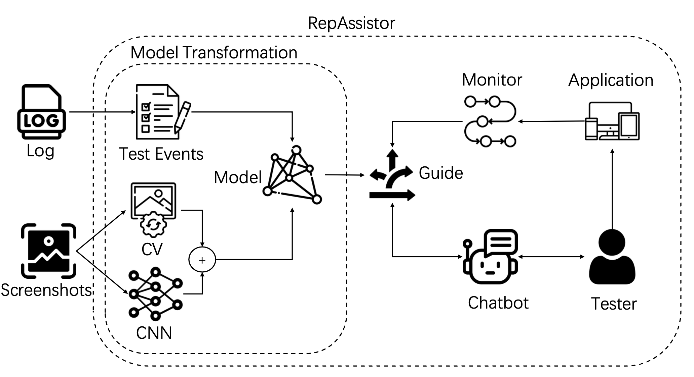

 &nbsp; &nbsp; 自动化测试可以有效保障软件质量。为了定位并解决自动化测试工具发现的软件缺陷，开发人员首先需要对自动化测试的结果进行复现。然而，由于自动化测试日志结构复杂，测试步骤繁多的特性，复现往往充满了难度。开发人员在复现测试结果时不仅需要依据日志尝试定位和识别缺陷，还需要在不同的测试环境下找到复现的关键步骤以确定缺陷触发流程。这无疑增加了开发者的工作负担。

 

为了解决这一问题，iSE 实验室房春荣老师指导硕士生李昕，创新性地提出了一种基于自动化测试工具的测试日志辅助开发人员进行缺陷复现的方法 RepAssistor。该方法首先处理复杂的自动化测试日志，依据日志中丰富的测试数据建立待测应用从初始化到发现缺陷的页面跳转模型，进而发现复现缺陷的完整路径。随后在开发者进行复现的同时开始监测，定位应用页面并利用交互式对话方式实时提供复现指导。RepAssistor 通过结构化的应用模型，精确地指导开发人员从应用的启动到最终触发缺陷，减轻了开发人员在复现过程中的负担。该方法融合自动化测试与实时对话代理交互，为测试结果复现提供了新的思路。研究成果《 Towards Effective Bug Reproduction for Mobile Applications 》已在国际会议 IEEE DSA 2023 发表，并荣获 Best Paper Award。

