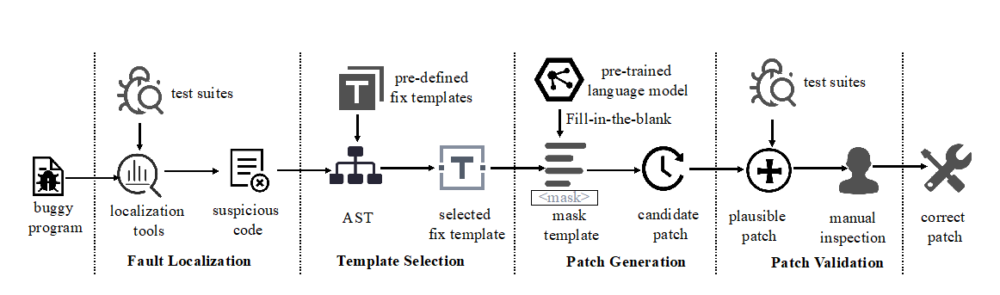

  &nbsp; &nbsp; &nbsp; 现代软件系统在版本演化中不可避免地伴随着缺陷的引入，而人工代码缺陷修复通常代价巨大且具有挑战性。为了降低软件缺陷修复过程中的人工代价，软件缺陷自动修复领域受到了非常广泛的关注。程序自动修复技术旨在没有人工干预的情况下，自动化地修复程序中的已知代码缺陷。近些年来随着深度学习技术在自动化软件工程中的成功应用以及开源社区中大量缺陷修复数据的获得，基于深度学习的程序修复技术逐渐获得了来自学术界和工业界的关注。但是现有的基于深度学习的的程序修复技术采用端到端的序列生成方式，需要理解复杂的代码业务逻辑，同时受限于长文本记忆的问题，在实际中的效果表现仍然非常有限，难以得到广泛的应用。

 

 

为了解决上述问题， iSE实验室房春荣老师指导博士生张犬俊，创新地提出了一种融合大语言模型和修复模板的自动程序修复技术GAMMA。区别于现有的基于深度学习的修复技术，GAMMA不需要在修复-缺陷数据对上进行训练，将补丁序列生成任务转换成完形填空预测任务。GAMMA首先利用现有的基于模板的程序修复技术提取了相应修复模板，然后将这些修复模板转换成完形填空样式，同时使用现有的大语言模型在修复模板中直接预测正确的代码片段。总体上，GAMMA具有极高的扩展性，可以应用到不同的修复模板、缺陷类型以及大语言模型中。

该工作首次展示了融合大语言模型和传统的修复技术进行补丁生成的广阔前景，对探索大语言模型的程序修复能力具有重要意义，值得后续研究人员的持续关注。相关研究成果形成了《GAMMA: Revisiting Template-based Automated Program Repair via Mask Prediction》已被软件工程领域顶级国际会议 International Conference on Automated Software Engineering（ASE2023, CCF-A类会议）全文录用，南京大学为唯一单位。

张犬俊同学由陈振宇教授和房春荣助理研究员共同指导，其主要研究方向包括智能软件测试和自动程序修复，研究成果先后全文发表在ISSTA、ICSE、ACL、TSE、ASE、TDSC等权威国际学术期刊和会议。

