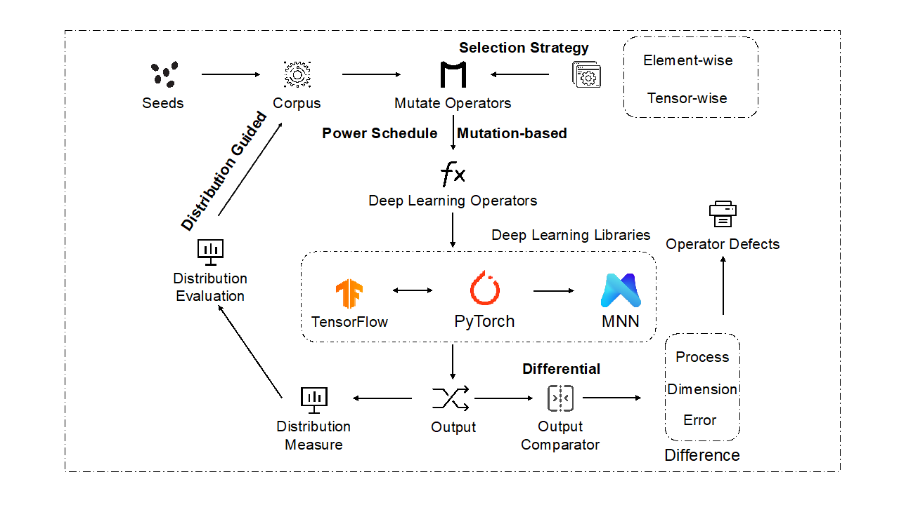

深度学习算子是实现模型构建、训练以及推理的基础。深度学习库对其进行封装，降低了开发人员使用深度学习技术的门槛。然而，近期的研究发现，深度学习库在带来模型开发便捷性的同时，也引入了潜在的问题。如何判断当前深度学习库提供的算子质量成为一项挑战。

 

我院iSE团队房春荣老师指导博士生章许帆与华为海思麒麟展开合作，创新性地提出了一种面向深度学习算子的差分模糊测试框架——Duo。该框架针对深度学习库中的待测算子，通过两类变异方法集实现算子测试输入生成，避免张量输入域子域划分过多的问题，并通过变异方法的选择策略、能量调度算法优化模糊测试执行过程，最后通过差分方法实现对算子的实现Bug、运行耗时和输出结果的多维评估。以我院博士生章许帆为第一作者的相关研究成果《Duo: Differential Fuzzing for Deep Learning Operators》已被IEEE Transactions on Reliability录用。

 

 

该研究是我院iSE团队在AI测试领域的又一项重要的产学研合作实践成果。Duo通过差分模糊测试实现了待测深度学习库内的算子质量评估，且不局限于数值精度问题。其与单个深度学习库上的精度测试方法（《Predoo: Precision Testing of Deep Learning Operators》ISSTA 21）以及宏观的网络图测试方法（《Graph-Based Fuzz Testing for Deep Learning Inference Engine》ICSE 2021）形成合力，推动深度学习库测试理论的发展，共同保障深度学习库质量，具有重要的工业应用价值。同时，该研究对于创新型人才培养、自主可控的AI测试技术研发、保障人工智能系统高质量落地具有重要意义。

 

以上工作得到了国家自然科学基金重点及面上项目、中央高校基本科研业务经费以及华为公司的资助。

